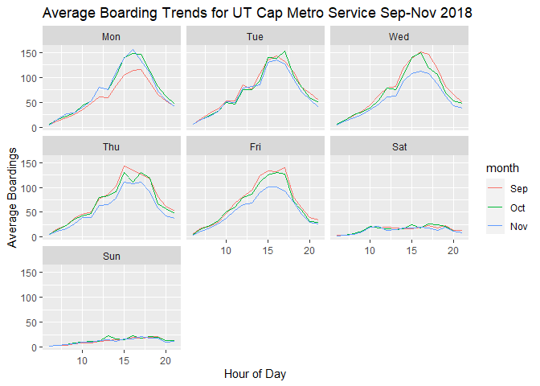
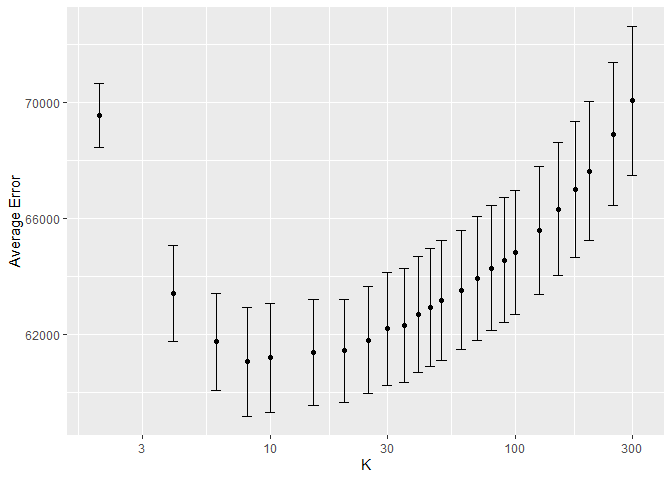
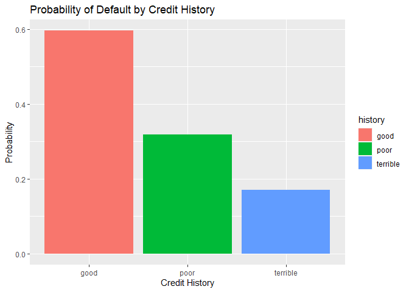

# Problem 1

## Average Boarding

Average boardings per hour are very similar during workdays. In
September, the average ridership looks significantly lower than in the
other months. It may be because school has just started and students are
trying to get a good start to their weeks on Mondays, so they leave with
enough time to walk instead of taking the bus. In November, the average
number of boardings is not much different than the other months, but
falls noticeably in the later days of the week. By now the semester is
so busy that students can barely leave the house on time at the
beginning of the week, but since the weather is nice and the weekend is
approaching soon they prefer to walk to class.

## Boardings and Temperature

The data seem to be clustered at the right side of the graph, which is
because the interquartile range for `temperature` is about 60 degrees to
80 degrees with a median of 73 degrees. Average ridership itself does
not seem to vary that much with temperature; average boardings seem to
be evenly distributed across temperatures.

# Problem 2

## Linear Model

    ## [1] 9590.392

My linear model regresses price on all variables excluding `pctCollege`
`fireplaces` `waterfront` and includes interactions on `landValue` and
`lotSize` , as well as on `bathrooms` and `bedrooms.` This model
performs better than the “medium” model from class.

## KNN Model

After trying different variations of the model, a regression with all
variables excluding `pctCollege`, `fireplaces` and `waterfront`
minimized the RMSE.

## K-Fold Cross Validation

### KNN Model

Using K-fold Cross Validation, we confirm that K = 15 is the best K for
the model, choosing with the “1SE” rule, which results in an RMSE of
61010.

### Linear Model

Performing K-fold cross validation with the linear model, we calculate
the approximated lowest RMSE:

    ## Linear Regression 
    ## 
    ## 1382 samples
    ##   15 predictor
    ## 
    ## No pre-processing
    ## Resampling: Cross-Validated (10 fold) 
    ## Summary of sample sizes: 1242, 1244, 1244, 1243, 1243, 1245, ... 
    ## Resampling results:
    ## 
    ##   RMSE      Rsquared   MAE     
    ##   59391.93  0.6364438  41958.62
    ## 
    ## Tuning parameter 'intercept' was held constant at a value of TRUE

The linear regression model produces a lower RMSE than the KNN model, so
in this case, a more general parametric model might be more useful for
this data in particular. A highlight of using a linear regression model
is that we can use field-specific knowledge to choose our features,
rather than letting KNN regression do the work for us.

# Problem 3

    ##         (Intercept)            duration              amount         installment 
    ##               -0.71                0.03                0.00                0.22 
    ##                 age         historypoor     historyterrible          purposeedu 
    ##               -0.02               -1.11               -1.88                0.72 
    ## purposegoods/repair       purposenewcar      purposeusedcar       foreigngerman 
    ##                0.10                0.85               -0.80               -1.26

Ironically, the probability of default increases with credit history
score. Looking at the data more closely, this unexpected result comes
from poor sampling:

    ## # A tibble: 3 x 3
    ##   History  `Number of Defaults`     N
    ##   <chr>                   <int> <int>
    ## 1 good                       53    89
    ## 2 poor                      197   618
    ## 3 terrible                   50   293

Obviously, the probability of default when `history == "good"` is high
because out of only 89 people sampled in that category, 53 of them had
defaulted on their loans. The bank should take a new random sample,
making sure to have an equal number of borrowers from each respective
credit history category.

# Problem 4

    ##    yhat
    ## y      0    1
    ##   0 8172   92
    ##   1  481  255

    ##    yhat
    ## y      0    1
    ##   0 8166   98
    ##   1  484  252

    ## [1] 0.001

The out of sample accuracy is almost 94% for the linear model specified,
which is slightly higher than the baseline 2 model, where `is_summer`
and `is_holiday` are features I generated from `arrival_date`.

### Model Validation: Step 1

    ## Warning: glm.fit: fitted probabilities numerically 0 or 1 occurred

    ## [1] 0.928

    ## Setting levels: control = 0, case = 1

    ## Setting direction: controls < cases

    ## Setting levels: control = 0, case = 1

    ## Setting direction: controls < cases

### Model Validation: Step 2

<table>
<caption>Tabulated Performance of Best Model</caption>
<thead>
<tr class="header">
<th style="text-align: left;"></th>
<th style="text-align: left;">Expected</th>
<th style="text-align: left;">Actual</th>
<th style="text-align: left;">Difference</th>
</tr>
</thead>
<tbody>
<tr class="odd">
<td style="text-align: left;">Fold01</td>
<td style="text-align: left;">20</td>
<td style="text-align: left;">22</td>
<td style="text-align: left;">2</td>
</tr>
<tr class="even">
<td style="text-align: left;">Fold02</td>
<td style="text-align: left;">23</td>
<td style="text-align: left;">24</td>
<td style="text-align: left;">1</td>
</tr>
<tr class="odd">
<td style="text-align: left;">Fold03</td>
<td style="text-align: left;">17</td>
<td style="text-align: left;">22</td>
<td style="text-align: left;">5</td>
</tr>
<tr class="even">
<td style="text-align: left;">Fold04</td>
<td style="text-align: left;">17</td>
<td style="text-align: left;">21</td>
<td style="text-align: left;">4</td>
</tr>
<tr class="odd">
<td style="text-align: left;">Fold05</td>
<td style="text-align: left;">23</td>
<td style="text-align: left;">23</td>
<td style="text-align: left;">0</td>
</tr>
<tr class="even">
<td style="text-align: left;">Fold06</td>
<td style="text-align: left;">24</td>
<td style="text-align: left;">22</td>
<td style="text-align: left;">-2</td>
</tr>
<tr class="odd">
<td style="text-align: left;">Fold07</td>
<td style="text-align: left;">22</td>
<td style="text-align: left;">19</td>
<td style="text-align: left;">-3</td>
</tr>
<tr class="even">
<td style="text-align: left;">Fold08</td>
<td style="text-align: left;">21</td>
<td style="text-align: left;">24</td>
<td style="text-align: left;">3</td>
</tr>
<tr class="odd">
<td style="text-align: left;">Fold09</td>
<td style="text-align: left;">23</td>
<td style="text-align: left;">18</td>
<td style="text-align: left;">-5</td>
</tr>
<tr class="even">
<td style="text-align: left;">Fold10</td>
<td style="text-align: left;">18</td>
<td style="text-align: left;">15</td>
<td style="text-align: left;">-3</td>
</tr>
<tr class="odd">
<td style="text-align: left;">Fold11</td>
<td style="text-align: left;">15</td>
<td style="text-align: left;">19</td>
<td style="text-align: left;">4</td>
</tr>
<tr class="even">
<td style="text-align: left;">Fold12</td>
<td style="text-align: left;">17</td>
<td style="text-align: left;">15</td>
<td style="text-align: left;">-2</td>
</tr>
<tr class="odd">
<td style="text-align: left;">Fold13</td>
<td style="text-align: left;">20</td>
<td style="text-align: left;">24</td>
<td style="text-align: left;">4</td>
</tr>
<tr class="even">
<td style="text-align: left;">Fold14</td>
<td style="text-align: left;">22</td>
<td style="text-align: left;">23</td>
<td style="text-align: left;">1</td>
</tr>
<tr class="odd">
<td style="text-align: left;">Fold15</td>
<td style="text-align: left;">20</td>
<td style="text-align: left;">19</td>
<td style="text-align: left;">-1</td>
</tr>
<tr class="even">
<td style="text-align: left;">Fold16</td>
<td style="text-align: left;">17</td>
<td style="text-align: left;">18</td>
<td style="text-align: left;">1</td>
</tr>
<tr class="odd">
<td style="text-align: left;">Fold17</td>
<td style="text-align: left;">20</td>
<td style="text-align: left;">20</td>
<td style="text-align: left;">0</td>
</tr>
<tr class="even">
<td style="text-align: left;">Fold18</td>
<td style="text-align: left;">20</td>
<td style="text-align: left;">24</td>
<td style="text-align: left;">4</td>
</tr>
<tr class="odd">
<td style="text-align: left;">Fold19</td>
<td style="text-align: left;">19</td>
<td style="text-align: left;">15</td>
<td style="text-align: left;">-4</td>
</tr>
<tr class="even">
<td style="text-align: left;">Fold20</td>
<td style="text-align: left;">17</td>
<td style="text-align: left;">15</td>
<td style="text-align: left;">-2</td>
</tr>
<tr class="odd">
<td style="text-align: left;">Total</td>
<td style="text-align: left;">395</td>
<td style="text-align: left;">402</td>
<td style="text-align: left;">-7</td>
</tr>
</tbody>
</table>

Tabulated Performance of Best Model

According to the table, over 20 folds of the `hotels_val` set there is
only a difference of 15 between expected and actual number of bookings
with children. With about 5,000 bookings in the 20 folds combined, this
number is pretty low.
